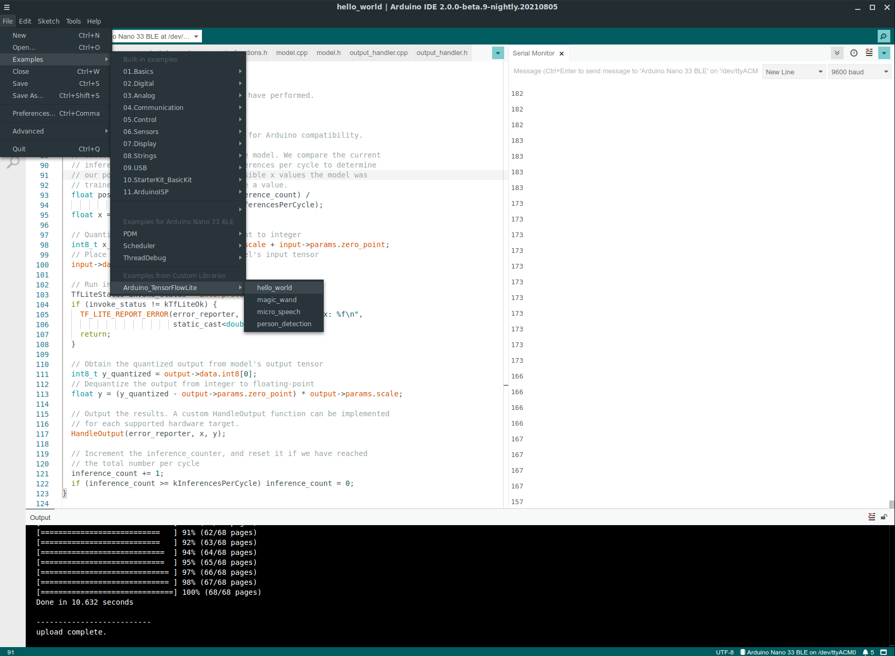

This repository will have the code (including examples) needed to use Tensorflow Lite Micro on an Arduino.

# Build Status

 

# Trying out the Code

To use the latest version of the TFLM Arduino examples directly from this GitHib
repository, you can clone the repo into `~/Arduino/libraries` and then open up the
TFLM examples in your Arduino IDE.

