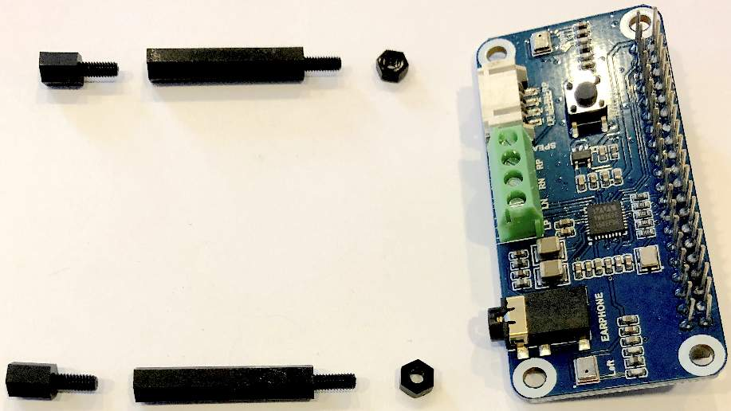
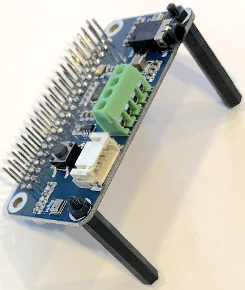
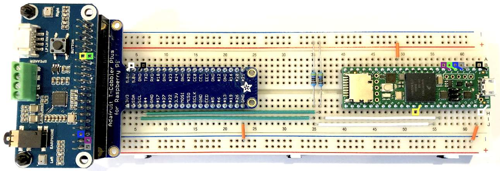
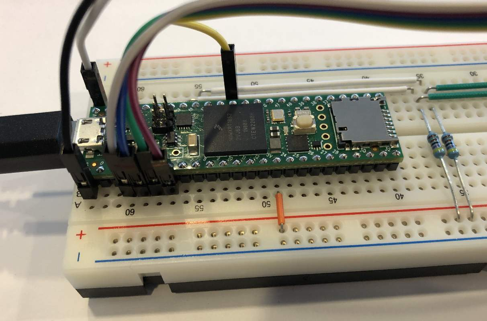

# TensorFlow Lite Micro Peripherals

This directory provides drivers with generic interfaces to peripherals used
with the TFLM examples.

Currently supported peripherals:
* Waveshare WM8960 Audio HAT
* Button on Waveshare WM8960 Audio HAT
* Default LED on Nano 33 BLE Sense

## Table of contents
<!--ts-->
* [Waveshare WM8960 Audio HAT](#waveshare-wm8960-audio-hat)
  * [Supported Capabilities](#supported-capabilities)
  * [Audio Board Pin Connections](#audio-board-pin-connections)
      * [Notes](#notes)
  * [Use with Tiny Machine Learning Kit (TMLK)](#use-with-tiny-machine-learning-kit-tmlk)
      * [Parts List and Tools Required](#parts-list-and-tools-required)
      * [Assembly](#assembly)
      * [Notes](#notes-1)
  * [Use with Teensy 4.1](#use-with-teensy-41)
      * [Teensy pins connected to T-Cobbler Plus:](#teensy-pins-connected-to-t-cobbler-plus)
      * [Teensy pins connected directly to audio board:](#teensy-pins-connected-directly-to-audio-board)
      * [Parts List and Tools Required](#parts-list-and-tools-required-1)
      * [Assembly](#assembly-1)
      * [Notes](#notes-2)
  * [Testing](#testing)
* [Button](#button)
* [LEDs](#leds)
<!--te-->

## Waveshare WM8960 Audio HAT

The [Waveshare WM8960 Audio HAT](https://www.waveshare.com/wm8960-audio-hat.htm) 
utilizes the WM8960 codec.
This audio board provides a stereo 3.5mm earphone jack and 1W speaker outputs
as well as stereo microphone inputs.

The earphone output is best used with 24 ohm (or higher) impedance headphones.

The USB power source must be capable of supplying a minimum of 500 milli-amps
in order to use the audio board with speakers attached.

### Supported Capabilities

This audio board has the following supported capabilities:
* stereo input
* stereo output
* earphone output
* 1W (max) speaker output
* 8 or 16 bits per channel
* standard samples rates from 8kHz to 48kHz
* simultaneous record and playback

### Audio Board Pin Connections

Even numbered pins are on the connector outside edge.
Odd numbered pins are on the connector inside edge.
With back facing up and text upright, pin 1 is on the left inside edge.

Male connectors are used for signals, female for power:

| | | | | | | | | | | | | | | | | | | | | |
|---|---|---|---|---|---|---|---|---|---|---|---|---|---|---|---|---|---|---|---|---|
|**Pin**| 1 | 3 | 5 | 7 | 9 | 11 | 13 | 15 | 17 | 19 | 21 | 23 | 25 | 27 | 29 | 31 | 33 | 35 | 37 | 39 |
|**Color**| | Red | Orange | | | Yellow | | | | | | | | | | | | Blue | | |
|**Function**| 3.3V | I2C_DATA | I2C_CLK | | Ground | BUTTON   3.3V pull-up | | | 3.3V | | | | Ground | | | | | I2S_LRCLK | | Ground |
|**Direction**| NC | IN/OUT | IN | | GND | OUT | | | NC | | | | GND | | | | | OUT | | GND |
| | | | | | | | | | | | | | | | | | | | | |

|| | | | | | | | | | | | | | | | | | | | |
|---|---|---|---|---|---|---|---|---|---|---|---|---|---|---|---|---|---|---|---|---|
|**Pin**| 2 | 4 | 6 | 8 | 10 | 12 | 14 | 16 | 18 | 20 | 22 | 24 | 26 | 28 | 30 | 32 | 34 | 36 | 38 | 40 |
|**Color**| White | | Black | | | Green | | | | | | | | | | | | | Purple | Gray |
|**Function**| 5V | 5V | Ground | | | I2S_BCLK | Ground | | | Ground | | | | | Ground | | Ground | | I2S_ADC | I2S_DAC |
|**Direction**| IN | IN | GND | | | OUT | GND | | | GND | | | | | GND | | GND | | OUT | IN |
|| | | | | | | | | | | | | | | | | | | | |

#### Notes

* WM8960 crystal is 23.9996MHz
* Oscilloscope measurements for 16KHz sample rate, 16 bits per channel, two channels
  * LR clock is 15.9998KHz
  * Bit clock is 511.992KHz

### Use with Tiny Machine Learning Kit (TMLK)

Wiring color in the tables matches the images in this document.
Jumper wire vendors may have other color combinations.

Power is supplied to the audio board by the green terminal block on the TMLK
shield.  `VIN` of the terminal block supplies +5V.

Note: `VIN` is connected to `VUSB` on the Nano 33 BLE Sense, thus when the
Nano 33 BLE Sense is powered by the USB cable, `VIN` will be an output.

Terminal block pins for power:

| Pin | Color | Function |
| --- | ---   | ---      | 
| VIN | White | 5V       |
| GND | Black | Ground   |
|     |       |          |

Dual row 20 pin connector for signaling:

| Pin | Color | Function                 | Direction |     | Pin | Color | Function | Direction |
| --- | ---   | ---                      | ---       | --- | --- | ---   | ---      | ---       |
| 1   |       | 3.3V                     | OUT       |     | 2   |       | Ground   | GND       |
| 3   | Orange| I2C_CLK                  | OUT       |     | 4   | Red   | I2C_DATA | IN/OUT    |
| 5   | Yellow| Button   3.3V pull-up | IN        |     | 6   |       |          |           |
| 7   |       |                          |           |     | 8   | Green | I2S_BCLK | IN        |
| 9   |       |                          |           |     | 10  |       |          |           |
| 11  |       |                          |           |     | 12  | Purple| I2S_ADC  | IN        |
| 13  | Gray  | I2S_DAC                  | OUT       |     | 14  |       |          |           |
| 15  |       |                          |           |     | 16  | Blue  | I2S_LRCLK| IN        |
| 17  |       |                          |           |     | 18  |       |          |           |
| 19  |       |                          |           |     | 20  |       |          |           |
|     |       |                          |           |     |     |       |          |           |

#### Parts List and Tools Required

The following tools are required:
* 2.5mm (or smaller) slotted screwdriver

Parts can be ordered from a number of vendors and distributors:
* DigiKey
* Mouser
* ProtoSupplies
* Adafruit
* SparkFun
* Amazon
* Arduino
* Waveshare

The following is the list of parts:
* [Tiny Machine Learning Kit](https://store-usa.arduino.cc/products/arduino-tiny-machine-learning-kit)
* [Waveshare WM8960 Audio HAT](https://www.waveshare.com/wm8960-audio-hat.htm) 
* 20cm male-male jumper wire, 2.54mm pitch (requires 2)
* 10cm male-female jumper wire, 2.54mm pitch (requires 7)
* M2.5 25mm male-female nylon standoffs with nuts, (requires 6 standoffs, 8 nuts)

The jumper wires are usually ordered in a pack of 40.

The nylon standoffs are usually ordered in a box assortment.

#### Assembly

1. Remove OV7675 camera from dual row 20 pin connector in middle of TMLK shield
2. Add nylon standoffs to the TMLK shield mounting holes
3. Add nylon standoffs to 3 of 4 mounting holes on the audio board
(see image).
The two nylon standoffs at the end of the audio board will need an extra nut
on the bottom side of the board to get the correct height.
4. The audio board attaches to the TMLK shield using a single nylon standoff,
with the audio board on top of the TMLK shield
(see image below)
5. On the TMLK shield, unscrew the green terminal block connections until the
metal gate is fully in the down (open) position
6. Insert black 20cm male-male jumper wire into the `GND` connector of the
green terminal block.
7. Insert white 20cm male-male jumper wire into the `VIN` connector of the
green terminal block
7. Turn the screws on the green terminal block connectors until the jumper
wire pins are firmly held in place
8. Connect the white jumper wire to pin 2 on the bottom of the audio board.
9. Connect the black jumper wire to pin 6 on the bottom of the audio board.
10. Check there is a one pin gap between the white and black jumper connections
on the bottom of the audio board (see [image](/docs/TMLK_WS_wm8960_images/IMG_1362.JPG)).
Failure to do this may result in a **FIRE**.  **Fire** is **bad**.
11. Connect the signal pins using the pin connection tables and images above

Fully assembled:

Additional images of fully assembled device:

#### Notes

* VIN/GND on TMLK board with all wires connected to WM8960
  * 4.66V with USB isolator
  * 4.65V without USB isolator

### Use with Teensy 4.1

Wiring color in the tables matches the images in this document.
Jumper wire vendors may have other color combinations.

Power is supplied to the audio board by `VIN` on the Teensy
board.  `VIN` of the board supplies +5V.

Note: `VIN` is connected to `VUSB` on the Teensy, thus when the
Teensy is powered by the USB cable, `VIN` will be an output.

#### Teensy pins connected to T-Cobbler Plus:

| Teensy label | Color | Breadboard   Location  | Function | T-Cobbler Plus   label |
| ---          | ---   | :---:                     | ---      | :---:                     |
| 5V (VIN)     | White | H-63, B-4                 | 5V       | 5.0V                      |
| G (GND)      | Black | B-63, B-6                 | Ground   | GND                       |
| 18           |       | I-5, I-35   J-35, J-55 | I2C_DATA | SDA                       |
| 19           |       | H-6, H-36   I-36, I-56 | I2C_CLK  | SCL                       |
|              |       |                           |          |                           |

#### Teensy pins connected directly to audio board:

| Teensy label | Color  | Breadboard   Location | Function                 | Direction |
| ---          | ---    | :---:                    | ---                      | ---       |
| 15           | Yellow | H-52                     | Button   3.3V pull-up | IN        |
| 4            | Green  | B-58                     | I2S_BCLK                 | IN        |
| 3            | Blue   | B-59                     | I2S_LRCLK                | IN        |
| 5            | Purple | B-57                     | I2S_ADC                  | IN        |
| 2            | Gray   | B-60                     | I2S_DAC                  | OUT       |
|              |        |                          |                          |           |

If you are having trouble reading the tiny labels on the Teensy board, you may
want to refer to the [Welcome to Teensy 4.1](https://www.pjrc.com/store/teensy41.html#pins)
pinout charts.

Jumper wire connections on the [audio board](#audio-board-pin-connections) remain the same
with the exception of the power and I2C pins, which are connected via the T-Cobbler Plus.

#### Parts List and Tools Required

The following tools are required:
* Wire cutter

Parts can be ordered from a number of vendors and distributors:
* DigiKey
* Mouser
* ProtoSupplies
* Adafruit
* SparkFun
* Amazon
* Waveshare

The following is the list of parts:
* [Teensy 4.1 Fully Loaded w/16Mbytes PSRAM option](https://protosupplies.com/product/teensy-4-1-fully-loaded/)
* [Waveshare WM8960 Audio HAT](https://www.waveshare.com/wm8960-audio-hat.htm)
* [Adafruit T-Cobbler Plus](https://www.adafruit.com/product/2028)
* 4.7K Ohm resistors (1/4 watt or higher) (requires 2)
* 7mm U-shaped (solid) jumper wire (requires 3)
* 50mm U-shaped (solid) jumper wire (requires 2)
* 75mm U-shaped (solid) jumper wire (requires 2)
* 20cm male-male jumper wire, 2.54mm pitch (requires 2)
* 20cm male-female jumper wire, 2.54mm pitch (requires 5)
* M2.5 25mm male-female nylon standoffs(requires 2)
* M2.5 6mm male-female nylon standoffs(requires 2)
* M2.5 nylon nut (requires 2)
* USB 2.0 Micro-B Male to USB A Male cable
* [Solderless Breadboard, 830 Tie-Points](https://protosupplies.com/product/solderless-breadboard-snap-lock-830-pro-series/)

The jumper wires are usually ordered in a pack of 40.
The U-shaped (solid) jumper wires are usually ordered in a box assortment.

The resistors can be ordered individually or as part of an assortment.

The nylon standoffs are usually ordered in a box assortment.

#### Assembly

1. Connect the nylon standoffs to the audio board mounting holes on the same side
of the audio board as the headphone/speaker connections.
2. Place the breadboard in front of you with the numbers on the breadboard
increasing from left to right.
2. Place the T-Cobbler Plus onto the breadboard with the 40-pin connecter on the
left edge of the breadboard.  The T-Cobbler Plus should be placed such that the
four corner pins match the following breadboard locations: `C-4, C-23, G-4, G-23`.
3. Place the audio board 40-pin connector into the T-Cobbler Plus 40-pin connector
such that the headphone/speaker connectors are on the left.  Make sure to center
the audio board 40-pin connector within the T-Cobbler Plus 40-pin connector, as
there are no guide rails on either connector.
Failure to do this may result in a **FIRE**.  **Fire** is **bad**.
4. Place the Teensy onto the breadboard with the USB connector on the right edge.
The Teensy should be placed such that the four corner pins match the following
breadboard locations: `C-63, G-63, C-40, G-40`.
5. Using a 7mm U-shaped (solid) jumper wire, connect breadboard location `J-62`
to the breadboard bottom `-` rail.
6. Using a 7mm U-shaped (solid) jumper wire, connect breadboard location `J-23`
to the breadboard bottom `-` rail.
7. Using a 7mm U-shaped (solid) jumper wire, connect breadboard location `A-49`
to the breadboard top `+` rail.
8. Using a 4.7K resistor, connect breadboard location `G-35` to the breadboard
top `+` rail.  The resistor leads will need to be bent and trimmed before
insertion into the breadboard.
9. Using a 4.7K resistor, connect breadboard location `G-36` to the breadboard
top `+` rail.  The resistor leads will need to be bent and trimmed before
insertion into the breadboard.
10. Using the 50mm and 75mm U-shaped (solid) jumper wire, connect to the
breadboard locations as per the [Teensy pins/T-Cobbler Plus table](#teensy-pins-connected-to-t-cobbler-plus).
11. Using the 20cm male-male jumper wire, connect to the breadboard locations as
per the [Teensy pins/T-Cobbler Plus table](#teensy-pins-connected-to-t-cobbler-plus).
12. Using the 20cm male-female jumper wire, connect to the breadboard locations as
per the [Teensy pins direct connection table](#teensy-pins-connected-directly-to-audio-board) and the
[audio board connections table](#audio-board-pin-connections).
13. Plug the USB 2.0 cable micro-B connector into the Teensy.

Fully assembled:

Additional images:

#### Notes

* VIN/GND on Teensy board with all wires connected to WM8960
  * 4.71V with USB isolator
  * 4.96V without USB isolator
* Plug the Teensy USB directly into a laptop or other USB power adapter
when using the speakers.
Do not plug into a USB hub, as the hub may not provide sufficient current
to power the Teensy and the speakers.  Do not use speakers when also using
a USB isolator due to current limits.

### Testing

The [audio_play_record](/src/peripherals/examples/audio_play_record/audio_play_record.ino)
test application is an audio API usage example.

1. Open the Arduino IDE
2. Open the `File` menu and navigate to: 
`Examples -> Arduino_TensorFlowLite -> src -> peripherals -> audio_play_record`
3. Load the `audio_play_record` application onto the Arduino supported board
4. The application is running when the default LED on the board is blinking.
5. Press and hold the button on the audio board until the LED stops blinking.  
Audio is now being recorded.
There is enough memory for approx. 3 seconds of recording.
Release the button to stop recording or wait until the LED is again blinking.
6. Press and release the button on the audio board to play the
previously recorded audio

## Button

A generic button event API is provided in the [button.h](/src/peripherals/button.h)
header file.

The physical button will vary between peripherals and platforms.  The GPIO pin
that connects to the button is defined in the [peripherals.h](/src/peripherals/peripherals.h)
header file.

The generic button API provides access to the debounced up/down state of the
button as well as the following button events:

* Button-Press
* Button-Long-Press-Down
* Button-Long-Press-Up

## LEDs

A generic LED API is provided in the [led.h](/src/peripherals/led.h) header file.

The physical default LED will vary between peripherals and platforms.
The GPIO pin that connects to the default LED is defined in the
[peripherals.h](/src/peripherals/peripherals.h) header file.

The generic LED API provides the following functionality:

* Turning the LED on/off
* Blinking the LED at an application defined duty cycle and rate
